# 2026 OOPL Final Report

## 組別資訊

組別：T09

組員：王彥文、李政翰

復刻遊戲：元氣騎士

## 專案簡介

### 遊戲簡介

《元氣騎士》是一款 Roguelike 地牢射擊遊戲，玩家需要探索關卡、擊敗敵人並蒐集武器。

### 組別分工

| 組員 | 負責內容 |
|------|---------|
| 王彥文 | 怪物、隨機地圖生成、小地圖UI、玩家狀態列、特殊武器實作、傭兵、寵物、戰鬥房間獎勵箱、玩家優化、子彈飛行系統、鏡頭跟隨、玩家角色|
| 李政翰 | 武器戰利箱、常規武器實作、玩家、登入畫面、傳送門、異常狀態 |

## 遊戲介紹

### 遊戲規則

玩家控制
- WASD 控制移動
- J 武器切換
- K 互動/攻擊
- L 技能

遊戲流程
- 開局大廳玩家可以與木製寶箱互動取得第二把武器
- 與大廳中間正上方傳送們互動，進入天賦選擇介面，從三擇一後進入1-1
- 1-1~1-4為常規關卡，每個關卡擁有怪物房間、寶箱房間、互動房間
- 玩家擁有血量、護盾、魔力，當護盾被破壞後所受到的傷害將直接減少血量，護盾可隨時間恢復，每把武器有不同的魔耗，使用後扣除玩家魔力
- 進入怪物房間後，房間門自動升起阻擋玩家離開，玩家必須消滅所有怪物房間門才會降下，並生成白銀寶箱，與白銀寶箱接觸可獲得金幣與魔力
- 怪物房間地圖物件中木製箱子可透過攻擊破壞，若帶有紅色標記的木製箱子遭到破壞會爆炸對周圍所有物體造成傷害
- 寶箱房間可開啟寶箱免費獲得一把隨機武器
- 互動房間可遇見傭兵，可消耗金幣使傭兵與玩家協同作戰
- 1-5為最終關卡，最終Boss生成，Boss血量、攻擊模式皆不同於常規怪物，打倒Boss後進入傳送門開啟通關結算畫面


### 遊戲畫面
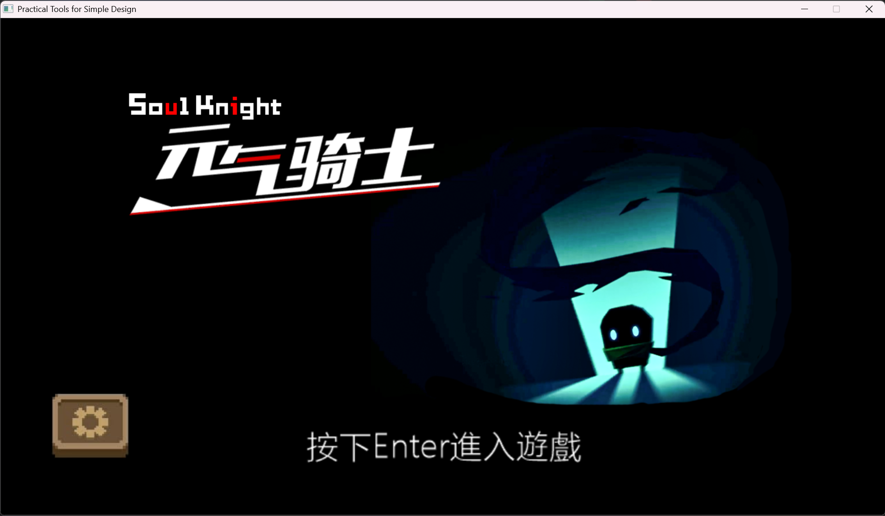

#### 登入畫面

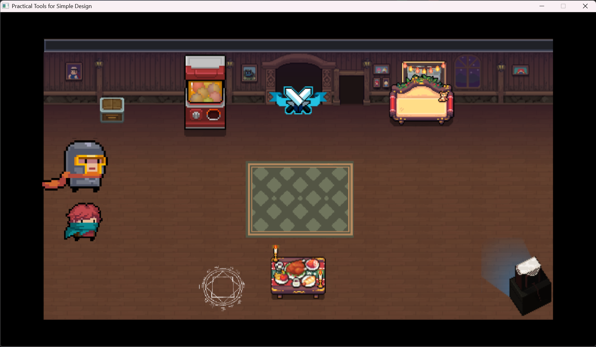

#### 進入到大廳選英雄

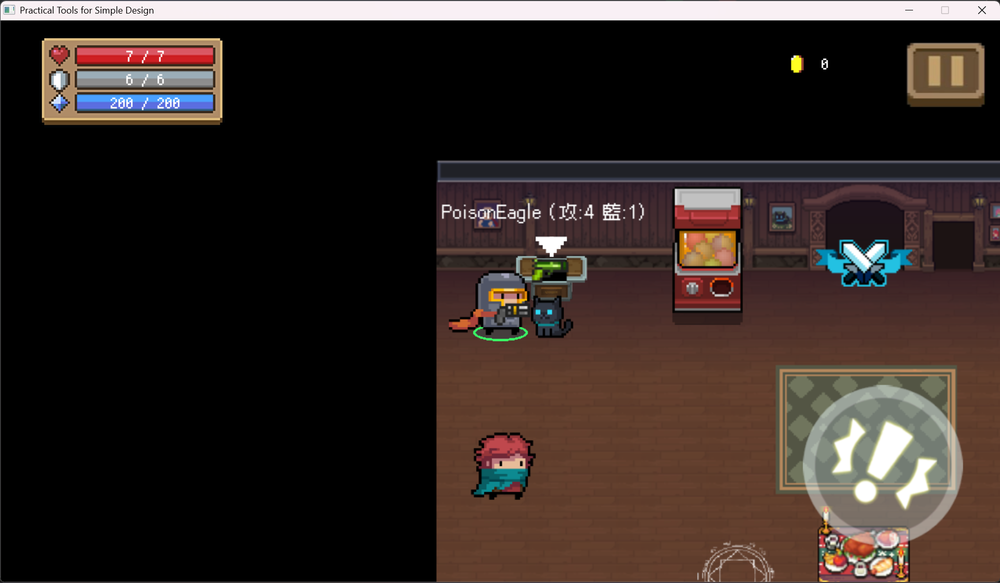

#### 大廳有免費初始武器寶箱可以開

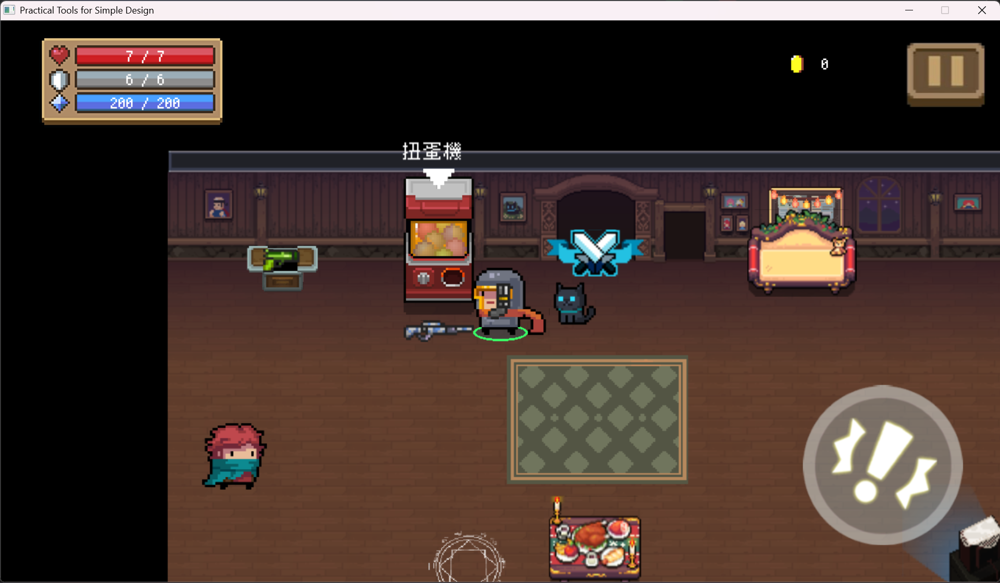

#### 大廳有扭蛋機可以扭出彩蛋

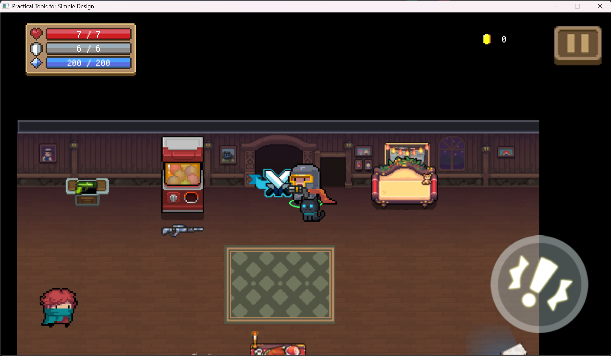

#### 與傳送門互動開始遊戲

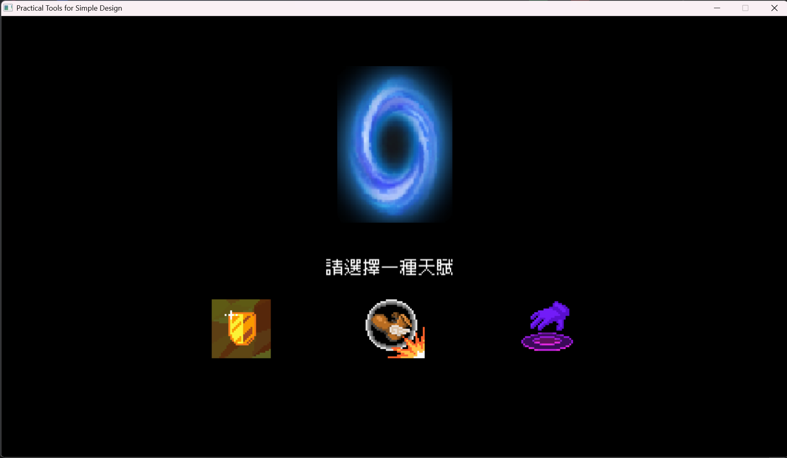

#### 初始可選擇天賦，後續通過小關卡可繼續添增天賦

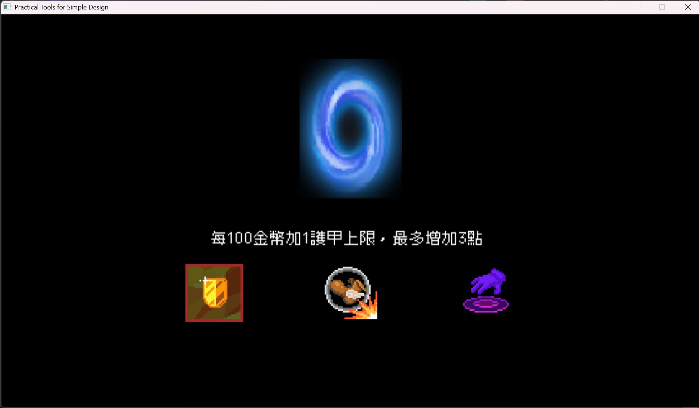

#### 有三種天賦可擇一

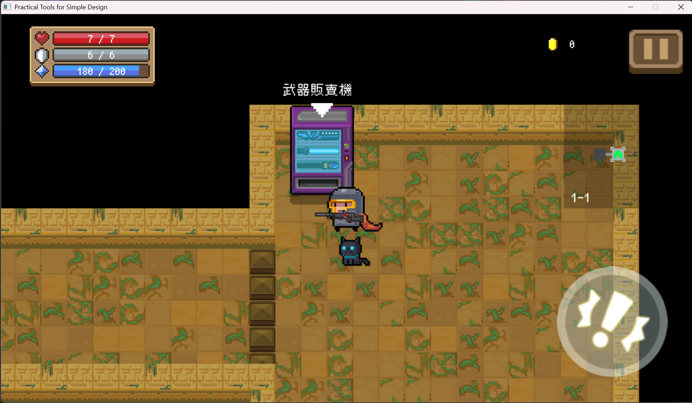

#### 初始房間有機會有互動式地圖物件

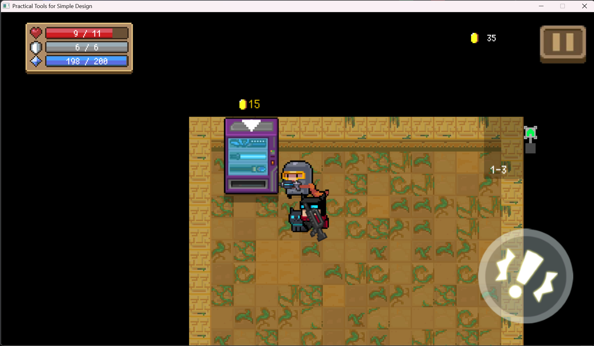

#### 可以透過武器販賣機購買武器

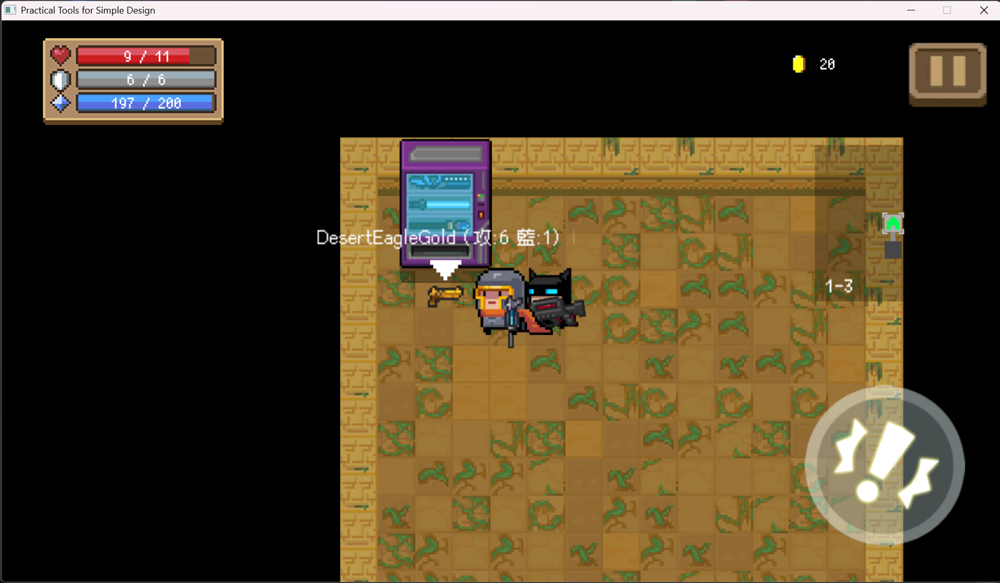

#### 可以透過武器販賣機購買武器

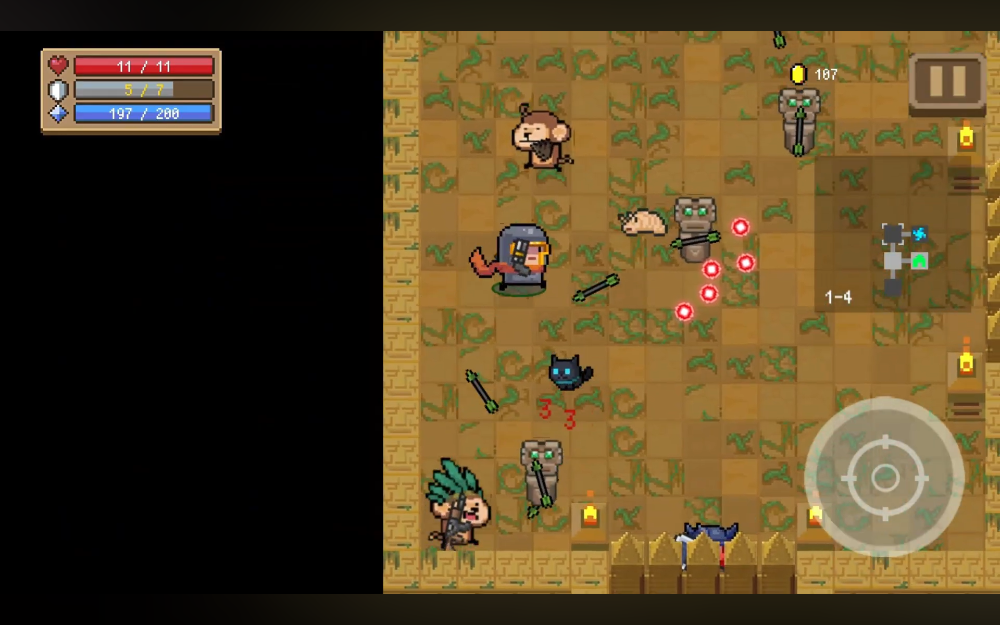

#### 與怪物們戰鬥

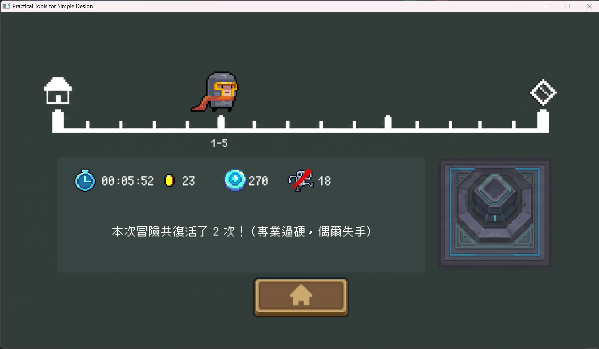

#### 遊戲結束通關結算畫面

## 程式設計

### 程式架構

本專案採用物件導向程式設計（Object-Oriented Programming）架構，透過繼承、多型、封裝與工廠模式管理遊戲中的各種物件與系統。專案底層使用學長提供的框架，主要以 `Util::GameObject` 作為可顯示物件的基底類別，並透過 `Drawable` 搭配 `Image` 或 `Animation` 進行畫面呈現。

主要遊戲物件繼承架構如下：

```text
Util::GameObject
├─ Character
│  ├─ Ammo
│  └─ Weapon
├─ AnimatedCharacter
│  ├─ Player
│  ├─ Monster
│  └─ Mercenary
├─ Structure
│  ├─ Chest
│  ├─ Portal
│  ├─ Potion
│  └─ VendingMachine
└─ DropItem
   ├─ Coin
   └─ EnergyOrb
```

除了主要遊戲物件外，專案也包含多個系統與 UI 輔助類別：

```text
系統與 UI 輔助類別
├─ Mapmanager
├─ MiniMap
├─ StatusBar
├─ BossStatusBar
├─ DamageNumber
├─ ResourceNumber
├─ TaskText
└─ InteractPrompt
```

整體架構可分為以下幾個模組：

#### 1. 遊戲主控系統（App）

`App` 類別為整個遊戲的核心控制器，負責統整各個系統並管理遊戲流程。

主要功能包含：

* 遊戲階段切換，例如開始畫面、天賦選擇、大廳、關卡與結算畫面。
* 玩家輸入處理。
* 持有並更新玩家、怪物、子彈、地圖與 UI 等主要物件。
* 擁有 UI 管理器，將 UI 更新與顯示邏輯集中處理。
* 擁有地圖管理器，將地圖生成、房間更新與地圖切換交由 `Mapmanager` 處理。
* 擁有怪物生成工廠，用於建立一般怪物、精英怪物與 Boss。
* 管理子彈碰撞、怪物碰撞與遊戲物件生命週期。

`App` 透過 `Phase` 列舉管理不同遊戲狀態，使遊戲流程更加清楚，也方便後續擴充新的畫面或關卡階段。

#### 2. 角色與遊戲物件系統（GameObject / Character）

本專案的可顯示物件主要以 `Util::GameObject` 為基底，並依照用途分為 `Character`、`AnimatedCharacter`、`Structure` 與 `DropItem` 等類別。

* `Character` 主要用於靜態圖片、座標與碰撞相關物件，例如 `Ammo` 與 `Weapon`。
* `AnimatedCharacter` 主要用於具有動畫狀態的角色，例如 `Player`、`Monster` 與 `Mercenary`。
* `Structure` 主要用於地圖互動物件，例如寶箱、傳送門、藥水與販賣機。
* `DropItem` 主要用於掉落物，例如金幣與能量球。

透過繼承共用座標、顯示、碰撞與更新邏輯，可以減少重複程式碼，並提升整體架構的可維護性。

#### 3. 武器系統（Weapon System）

武器系統以 `Weapon` 作為基底類別，並由不同子類別實作不同攻擊方式。

目前武器類型包含：

* `Single`：單發射擊
* `Tripple`：三連發射擊
* `Mutiple`：散射攻擊
* `Parallel`：平行射擊
* `Wave`：近戰揮砍
* `WaveMuti`：近戰與遠程混合
* `ExplosivePackWeapon`：炸藥攻擊
* `GravityPullWeapon`：引力牽引
* `LaserWeapon`：雷射攻擊
* `PoisonFanWeapon`：扇形毒粒子攻擊
* `ReverseRingWeapon`：反向環形攻擊
* `ShockwaveWeapon`：震盪波攻擊

每種武器皆覆寫 `Attack()` 函式，實作自身的攻擊行為。玩家或怪物只需要透過 `Weapon` 介面呼叫 `Attack()`，即可執行不同武器的攻擊邏輯，達成多型設計。

#### 4. 武器工廠（WeaponFactory）

專案使用 Factory Pattern 管理武器生成。

`WeaponFactory` 根據 `WeaponName` 列舉建立對應武器，主要功能包含：

* 建立指定武器。
* 建立隨機武器。
* 複製既有武器。

透過工廠模式集中管理武器建立流程，可以避免生成邏輯散落在玩家、怪物或寶箱等類別中，降低程式耦合度，也讓新增武器時更容易維護。

#### 5. 怪物系統（Monster System）

怪物系統以 `Monster` 作為主要類別，負責怪物的移動、攻擊、受傷、死亡與掉落獎勵等行為。

主要功能包含：

* 追蹤玩家與移動。
* 攻擊判斷。
* 受傷與死亡處理。
* 掉落金幣、能量或其他獎勵。
* Boss 與特殊怪物行為擴充。

`MonsterFactory` 負責建立不同種類的怪物，例如一般怪物、精英怪物與 Boss，使怪物生成邏輯與怪物本體分離。

此外，Boss 可透過 `CompositeMonster` 進行組合式設計，讓大型怪物能由主體與多個部件組成，使 Boss 的外觀與行為更容易擴充。

#### 6. 地圖系統（Mapmanager）

`Mapmanager` 負責 Roguelike 地圖生成與房間事件管理。

主要功能包含：

* 隨機生成房間。
* 建立房間之間的走道。
* 管理房間種類，例如戰鬥房、寶箱房、互動房與 Boss 房。
* 控制房間門開關。
* 觸發房間事件。
* 生成房間內怪物、陷阱與可破壞物件。
* 提供小地圖顯示所需資料。

房間以 `Room` 結構儲存資料，包含房間範圍、房間種類、房間狀態、怪物、門與事件資訊。玩家進入房間後，`Mapmanager` 會依照房間狀態觸發對應事件，例如關門、生成怪物、清除怪物後開門，以及生成獎勵箱。

#### 7. 互動物件系統（Structure）

所有地圖互動物件皆繼承自 `Structure`，例如：

* 傳送門
* 木箱
* 武器寶箱
* 戰鬥獎勵箱
* 藥水
* 販賣機

`Structure` 透過 `Interact()` 虛擬函式提供統一互動介面。不同互動物件覆寫 `Interact()` 後，即可實作不同效果，例如進入下一關、開啟寶箱、購買物品或恢復能力。

此設計讓玩家互動系統不需要針對每種物件寫大量判斷，只需要呼叫共同的 `Interact()` 介面，即可透過多型執行不同互動行為。

#### 8. 子彈系統（Ammo / BulletManager）

子彈系統以 `Ammo` 作為子彈物件類別，並由 `BulletManager` 統一管理玩家子彈與敵人子彈。

主要功能包含：

* 子彈生成。
* 子彈飛行更新。
* 子彈生命週期管理。
* 玩家子彈與敵人碰撞。
* 敵人子彈與玩家碰撞。
* 近戰武器消除敵方彈幕。
* 特殊子彈效果處理。

部分特殊武器會透過 Lambda Function 或自訂更新邏輯控制子彈行為，例如引力、毒液擴散或特殊軌跡，使特殊效果不需要全部寫死在 `Ammo` 類別內，提升擴充彈性。

#### 9. UI 系統

遊戲內 UI 由獨立的 UI 類別與管理器負責，避免 UI 邏輯與遊戲核心邏輯混雜。

UI 內容包含：

* 玩家血量。
* 護盾。
* 魔力。
* 金幣。
* Boss 血條。
* 傷害數字。
* 資源數字。
* 小地圖。
* 互動提示文字。
* 任務提示文字。
* 天賦選擇介面。
* 遊戲結算畫面。

#### 10. 音效管理系統（AudioManager）

專案額外實作 `AudioManager` 統一管理遊戲音效與背景音樂。

主要功能包含：

* 管理主音量、背景音樂音量與音效音量。
* 依照遊戲階段切換不同背景音樂。
* 播放一般音效，例如攻擊、互動、受傷等效果音。
* 支援循環音效，例如持續性技能或特殊場景音效。
* 避免相同 BGM 重複載入與播放，降低音樂切換時的不必要開銷。

透過 `AudioManager` 將音效邏輯獨立出來，可以避免 `App` 或各個遊戲物件直接處理音樂播放細節，使音效管理更集中且容易維護。


透過 `UIManager` 與多個 UI 輔助類別分工管理畫面資訊，可以提升程式可讀性，也方便後續新增新的 UI 元件。
### 程式架構

本專案採用物件導向程式設計（Object-Oriented Programming）架構，透過繼承、多型、封裝與工廠模式管理遊戲中的各種物件與系統。專案底層主要以 `Util::GameObject` 作為可顯示物件的基底類別，並透過 `Drawable` 搭配 `Image` 或 `Animation` 進行畫面呈現。

主要遊戲物件繼承架構如下：

```text
Util::GameObject
├─ Character
│  ├─ Ammo
│  └─ Weapon
├─ AnimatedCharacter
│  ├─ Player
│  ├─ Monster
│  └─ Mercenary
├─ Structure
│  ├─ Chest
│  ├─ Portal
│  ├─ Potion
│  └─ VendingMachine
└─ DropItem
   ├─ Coin
   └─ EnergyOrb
```

除了主要遊戲物件外，專案也包含多個系統與 UI 輔助類別：

```text
系統與 UI 輔助類別
├─ Mapmanager
├─ MiniMap
├─ StatusBar
├─ BossStatusBar
├─ DamageNumber
├─ ResourceNumber
├─ TaskText
└─ InteractPrompt
```

整體架構可分為以下幾個模組：

#### 1. 遊戲主控系統（App）

`App` 類別為整個遊戲的核心控制器，負責統整各個系統並管理遊戲流程。

主要功能包含：

* 遊戲階段切換，例如開始畫面、天賦選擇、大廳、關卡與結算畫面。
* 玩家輸入處理。
* 持有並更新玩家、怪物、子彈、地圖與 UI 等主要物件。
* 擁有 UI 管理器，將 UI 更新與顯示邏輯集中處理。
* 擁有地圖管理器，將地圖生成、房間更新與地圖切換交由 `Mapmanager` 處理。
* 擁有怪物生成工廠，用於建立一般怪物、精英怪物與 Boss。
* 管理子彈碰撞、怪物碰撞與遊戲物件生命週期。

`App` 透過 `Phase` 列舉管理不同遊戲狀態，使遊戲流程更加清楚，也方便後續擴充新的畫面或關卡階段。

#### 2. 角色與遊戲物件系統（GameObject / Character）

本專案的可顯示物件主要以 `Util::GameObject` 為基底，並依照用途分為 `Character`、`AnimatedCharacter`、`Structure` 與 `DropItem` 等類別。

* `Character` 主要用於靜態圖片、座標與碰撞相關物件，例如 `Ammo` 與 `Weapon`。
* `AnimatedCharacter` 主要用於具有動畫狀態的角色，例如 `Player`、`Monster` 與 `Mercenary`。
* `Structure` 主要用於地圖互動物件，例如寶箱、傳送門、藥水與販賣機。
* `DropItem` 主要用於掉落物，例如金幣與能量球。

透過繼承共用座標、顯示、碰撞與更新邏輯，可以減少重複程式碼，並提升整體架構的可維護性。

#### 3. 武器系統（Weapon System）

武器系統以 `Weapon` 作為基底類別，並由不同子類別實作不同攻擊方式。

目前武器類型包含：

* `Single`：單發射擊
* `Tripple`：三連發射擊
* `Mutiple`：散射攻擊
* `Parallel`：平行射擊
* `Wave`：近戰揮砍
* `WaveMuti`：近戰與遠程混合
* `ExplosivePackWeapon`：炸藥攻擊
* `GravityPullWeapon`：引力牽引
* `LaserWeapon`：雷射攻擊
* `PoisonFanWeapon`：扇形毒粒子攻擊
* `ReverseRingWeapon`：反向環形攻擊
* `ShockwaveWeapon`：震盪波攻擊

每種武器皆覆寫 `Attack()` 函式，實作自身的攻擊行為。玩家或怪物只需要透過 `Weapon` 介面呼叫 `Attack()`，即可執行不同武器的攻擊邏輯，達成多型設計。

#### 4. 武器工廠（WeaponFactory）

專案使用 Factory Pattern 管理武器生成。

`WeaponFactory` 根據 `WeaponName` 列舉建立對應武器，主要功能包含：

* 建立指定武器。
* 建立隨機武器。
* 複製既有武器。

透過工廠模式集中管理武器建立流程，可以避免生成邏輯散落在玩家、怪物或寶箱等類別中，降低程式耦合度，也讓新增武器時更容易維護。

#### 5. 怪物系統（Monster System）

怪物系統以 `Monster` 作為主要類別，負責怪物的移動、攻擊、受傷、死亡與掉落獎勵等行為。

主要功能包含：

* 追蹤玩家與移動。
* 攻擊判斷。
* 受傷與死亡處理。
* 掉落金幣、能量或其他獎勵。
* Boss 與特殊怪物行為擴充。

`MonsterFactory` 負責建立不同種類的怪物，例如一般怪物、精英怪物與 Boss，使怪物生成邏輯與怪物本體分離。

此外，Boss 可透過 `CompositeMonster` 進行組合式設計，讓大型怪物能由主體與多個部件組成，使 Boss 的外觀與行為更容易擴充。

#### 6. 地圖系統（Mapmanager）

`Mapmanager` 負責 Roguelike 地圖生成與房間事件管理。

主要功能包含：

* 隨機生成房間。
* 建立房間之間的走道。
* 管理房間種類，例如戰鬥房、寶箱房、互動房與 Boss 房。
* 控制房間門開關。
* 觸發房間事件。
* 生成房間內怪物、陷阱與可破壞物件。
* 提供小地圖顯示所需資料。

房間以 `Room` 結構儲存資料，包含房間範圍、房間種類、房間狀態、怪物、門與事件資訊。玩家進入房間後，`Mapmanager` 會依照房間狀態觸發對應事件，例如關門、生成怪物、清除怪物後開門，以及生成獎勵箱。

#### 7. 互動物件系統（Structure）

所有地圖互動物件皆繼承自 `Structure`，例如：

* 傳送門
* 木箱
* 武器寶箱
* 戰鬥獎勵箱
* 藥水
* 販賣機

`Structure` 透過 `Interact()` 虛擬函式提供統一互動介面。不同互動物件覆寫 `Interact()` 後，即可實作不同效果，例如進入下一關、開啟寶箱、購買物品或恢復能力。

此設計讓玩家互動系統不需要針對每種物件寫大量判斷，只需要呼叫共同的 `Interact()` 介面，即可透過多型執行不同互動行為。

#### 8. 子彈系統（Ammo / BulletManager）

子彈系統以 `Ammo` 作為子彈物件類別，並由 `BulletManager` 統一管理玩家子彈與敵人子彈。

主要功能包含：

* 子彈生成。
* 子彈飛行更新。
* 子彈生命週期管理。
* 玩家子彈與敵人碰撞。
* 敵人子彈與玩家碰撞。
* 近戰武器消除敵方彈幕。
* 特殊子彈效果處理。

部分特殊武器會透過 Lambda Function 或自訂更新邏輯控制子彈行為，例如引力、毒液擴散或特殊軌跡，使特殊效果不需要全部寫死在 `Ammo` 類別內，提升擴充彈性。

#### 9. UI 系統

遊戲內 UI 由獨立的 UI 類別與管理器負責，避免 UI 邏輯與遊戲核心邏輯混雜。

UI 內容包含：

* 玩家血量。
* 護盾。
* 魔力。
* 金幣。
* Boss 血條。
* 傷害數字。
* 資源數字。
* 小地圖。
* 互動提示文字。
* 任務提示文字。
* 天賦選擇介面。
* 遊戲結算畫面。

透過 `UIManager` 與多個 UI 輔助類別分工管理畫面資訊，可以提升程式可讀性，也方便後續新增新的 UI 元件。


### 程式技術

本專案在開發過程中運用了多種物件導向與遊戲程式設計技術，包含繼承、多型、工廠模式、智慧指標、狀態管理、程序化地圖生成、子彈管理、特殊武器邏輯、UI 管理與遊戲事件系統等。

#### 1. 繼承（Inheritance）

專案以 `Util::GameObject` 作為可顯示物件的基底類別，並依照功能分為 `Character`、`AnimatedCharacter`、`Structure` 與 `DropItem` 等類別。

```text
Util::GameObject
├─ Character
│  ├─ Ammo
│  └─ Weapon
├─ AnimatedCharacter
│  ├─ Player
│  ├─ Monster
│  └─ Mercenary
├─ Structure
│  ├─ Portal
│  ├─ Chest
│  ├─ Potion
│  └─ VendingMachine
└─ DropItem
   ├─ Coin
   └─ EnergyOrb
```

其中 `Character` 用於靜態圖片與碰撞物件，例如子彈與武器；`AnimatedCharacter` 用於具有動畫狀態的角色，例如玩家、怪物與傭兵；`Structure` 用於地圖互動物件；`DropItem` 則用於金幣與能量球等掉落物。

透過繼承共用座標、顯示、碰撞與更新邏輯，可以減少重複程式碼，並提升程式可維護性。

#### 2. 多型（Polymorphism）

專案透過虛擬函式實作多型，使不同物件能以相同介面執行不同功能。

武器系統中，`Weapon` 定義共同攻擊介面：

```cpp
virtual void Attack(App* app, glm::vec2 direction);
```

不同武器類別如 `Single`、`Tripple`、`Mutiple`、`Parallel`、`Wave`、`LaserWeapon` 等皆覆寫 `Attack()`，實作各自的攻擊方式。玩家或怪物只需要透過 `Weapon` 介面呼叫 `Attack()`，即可使用不同武器。

互動物件系統中，`Structure` 定義共同互動介面：

```cpp
virtual void Interact(App& app);
```

例如寶箱、傳送門、藥水與販賣機都能覆寫 `Interact()`，實作不同互動效果。此設計讓玩家互動系統不需要針對每種物件寫大量判斷，只需要呼叫共同介面即可透過多型執行不同功能。

#### 3. 工廠模式（Factory Pattern）

專案使用工廠模式集中管理物件生成流程。

主要包含：

* `WeaponFactory`
* `MonsterFactory`
* `MercenaryFactory`

`WeaponFactory` 根據 `WeaponName` 建立指定武器、隨機武器或複製武器；`MonsterFactory` 根據 `MonsterType` 建立一般怪物、精英怪物、Boss 與特殊資源物件；`MercenaryFactory` 則根據傭兵類型建立對應傭兵，並配置血量、價格、動畫與初始武器。

透過工廠模式，生成邏輯可以集中管理，避免大量建立物件的程式碼散落在玩家、地圖、寶箱或怪物系統中，使新增武器、怪物與傭兵時更加方便。

#### 4. 智慧指標（Smart Pointer）

專案大量使用 `std::shared_ptr` 管理遊戲物件生命週期，例如玩家、怪物、子彈、武器、寶箱、UI 物件與掉落物。

由於遊戲物件通常同時存在於邏輯容器與渲染樹中，例如：

```cpp
m_Root.AddChild(object);
m_Root.RemoveChild(object);
```

使用智慧指標可以降低手動釋放記憶體的負擔，減少記憶體洩漏與懸空指標的風險。

此外，部分靜態碰撞物件使用 `weak_ptr` 進行管理，當物件已被銷毀時可以安全移除失效參考，避免碰撞判斷時存取不存在的物件。

#### 5. 遊戲狀態管理（Game Phase Management）

`App` 使用 `Phase` 列舉管理遊戲流程，例如登入畫面、大廳、天賦選擇、關卡、暫停、勝利與結算畫面。

流程包含：

```text
LOGGING
→ LOBBY
→ TALENT_CHOOSE
→ LEVEL1
→ LEVEL2
→ LEVEL3
→ LEVEL4
→ LEVEL5
→ WIN / SETTLEMENT
```

不同階段會初始化不同 UI、地圖、玩家與遊戲物件。透過狀態切換，可以讓遊戲流程更清楚，也方便新增新的畫面或關卡。

#### 6. 狀態機（State Machine）

專案多處使用狀態機控制物件行為。

武器系統使用：

```text
STANDBY → ATTACKING → CDING
```

控制攻擊、攻擊中與冷卻流程。

房間系統使用房間狀態控制事件，例如：

* 未觸發
* 戰鬥中
* 已通關

傭兵系統也透過狀態控制行為，例如：

```text
UNHIRED → FOLLOW → DEAD
```

玩家技能也具有狀態控制，例如技能是否啟動、技能持續時間、冷卻時間與無敵時間。透過狀態機可以避免大量混亂的條件判斷，使邏輯更容易維護。

#### 7. 程序化地牢生成（Procedural Dungeon Generation）

地圖系統由 `Mapmanager` 負責，並使用程序化生成方式建立 Roguelike 地牢。

生成流程包含：

1. 先建立房間拓樸結構。
2. 隨機決定戰鬥房、寶箱房、商店房、特殊房與 Boss 房。
3. 避免房間重疊。
4. 建立房間之間的連線。
5. 依照房間種類讀取對應地圖模板。
6. 生成走道、門、牆壁與地圖物件。
7. 在房間中生成怪物、寶箱、傳送門、陷阱或互動物件。
8. 將房間連線資訊提供給小地圖系統。

此設計讓每次進入關卡時都能產生不同配置，提高遊戲重玩性。

#### 8. 房間事件系統（Room Event System）

玩家進入房間後，`Mapmanager` 會依照房間種類與狀態觸發事件。

戰鬥房流程包含：

```text
玩家進入房間
→ 房門關閉
→ 生成怪物
→ 判斷怪物是否清空
→ 房門開啟
→ 生成獎勵箱
```

不同房間具有不同事件，例如寶箱房可以開啟寶箱，商店房可以購買物品，特殊房可以遇見傭兵或互動物件，Boss 房則會生成最終 Boss。

此系統模擬《元氣騎士》的房間戰鬥節奏，使關卡推進更有結構。

#### 9. 子彈系統與碰撞檢測（Ammo / BulletManager）

子彈系統由 `Ammo` 與 `BulletManager` 組成。

`Ammo` 負責單顆子彈的資料，例如：

* 方向
* 速度
* 傷害
* 生命週期
* 是否過期
* 是否穿透
* 是否反彈
* 是否為近戰
* 是否為炸彈
* 是否具有特殊效果

`BulletManager` 則統一管理玩家子彈與敵人子彈，負責：

* 子彈更新
* 生命週期檢查
* 玩家子彈與怪物碰撞
* 敵人子彈與玩家碰撞
* 子彈與牆壁、門、箱子的碰撞
* 子彈穿透與彈射判斷
* 炸彈範圍傷害
* 近戰武器消除敵方彈幕
* 特殊子彈效果處理

將子彈邏輯集中在 `BulletManager` 中，可以避免碰撞與銷毀邏輯散落在玩家、怪物與武器類別中。

#### 10. Lambda 客製化飛行邏輯

部分特殊子彈並不是單純直線飛行，因此 `Ammo` 支援自訂更新邏輯。

若子彈具有自訂邏輯，`Ammo::Update()` 會執行該邏輯；若沒有，則使用預設直線飛行：

```cpp
ammo->SetUpdateLogic(...);
```

此設計讓特殊武器可以透過 Lambda Function 注入行為，例如：

* 旋轉子彈
* 毒液擴散
* 特殊軌跡
* 引力圈效果
* 分裂或持續效果

這樣不需要為每一種特殊子彈都建立新的子類別，也能保持 `Ammo` 架構的彈性。

#### 11. 特殊武器效果系統

本專案的武器系統不只支援一般射擊，也支援多種特殊攻擊模式。

例如：

* `Single`：單發射擊。
* `Tripple`：三連發或連續射擊。
* `Mutiple`：散射攻擊。
* `Parallel`：平行發射。
* `Wave`：近戰揮砍。
* `WaveMuti`：近戰與遠程混合。
* `ExplosivePackWeapon`：產生爆炸範圍傷害。
* `GravityPullWeapon`：產生引力圈，吸引範圍內目標。
* `LaserWeapon`：以射線偵測牆壁距離，並沿雷射路徑產生傷害判定。
* `PoisonFanWeapon`：扇形散射毒性投射物。
* `ReverseRingWeapon`：產生特殊狀態影響。
* `ShockwaveWeapon`：產生範圍震盪攻擊。

其中 `GravityPullWeapon` 會建立具有引力標記的 `Ammo`，並隨時間縮小吸引範圍；`LaserWeapon` 則會先偵測雷射碰到牆壁的位置，再沿著雷射路徑生成多個短生命週期的傷害判定點。

這些武器皆共用 `Weapon`、`Ammo` 與 `BulletManager` 系統，但透過不同的 `Attack()` 實作達成不同攻擊效果。

#### 12. 怪物 AI 與行為注入

怪物系統以 `Monster` 作為共用基底，提供血量、動畫、移動、受傷、死亡、擊退與狀態效果等功能。

一般怪物使用 `Monster` 內建 AI，例如追蹤玩家、遊走、判斷攻擊距離與碰撞牆壁。

特殊怪物則可以透過 AI 注入方式改變行為：

```cpp
monster->SetAILogic(...);
```

例如固定砲塔型怪物可以使用自訂 AI，使武器持續旋轉並向周圍發射彈幕。此設計讓特殊怪物不需要額外建立大量子類別，也能擁有獨立行為。

#### 13. 組合式 Boss 設計（Composite Monster）

Boss 系統中使用 `CompositeMonster` 建立大型怪物。

`CompositeMonster` 可以由主體與多個身體部件組成，例如手臂、裝飾物件或武器部位。每個部件可以設定與主體的相對位置，並在主體移動或翻面時同步更新。

此設計讓大型 Boss 不必只是一張單一圖片，而是可以由多個物件組合而成，方便製作更複雜的 Boss 外觀與動畫效果。

#### 14. 異常狀態系統（Status Effect System）

玩家與怪物皆支援異常狀態系統。

狀態種類包含：

* Burned：燃燒
* Frozen：冰凍
* Poisoned：中毒
* Dizziness：暈眩
* Electrification：感電
* None：無狀態

每種狀態會透過計時器控制持續時間，並產生不同效果。例如燃燒與中毒會在一段時間內持續扣血，冰凍與暈眩會暫停角色行動或動畫。

此系統讓武器與怪物攻擊能產生更多變化，也提高遊戲策略性。

#### 15. 天賦系統（Talent System）

玩家具有天賦系統，可在關卡開始前選擇不同能力強化。

天賦效果包含：

* 增加生命上限
* 增加護盾上限
* 增加魔力上限
* 提升攻擊速度
* 降低敵方子彈速度
* 提升暴擊率與精準度
* 子彈碰牆反彈
* 破盾保護
* 金幣轉換護盾上限
* 強化傭兵或寵物

天賦會直接影響玩家、武器、子彈或同伴系統，使每次遊玩都能產生不同流派與策略。

#### 16. 傭兵與寵物系統

專案實作傭兵與寵物系統，使玩家不只是單人戰鬥。

傭兵可透過金幣雇用，雇用後會跟隨玩家、自動索敵、自動攻擊，並可裝備武器。傭兵也具有生命值，受到攻擊後可能死亡。

寵物則會跟隨玩家移動，並具有待機、奔跑與特殊待機動畫。當距離玩家太遠時，寵物會自動傳送回玩家附近，避免在房間切換或戰鬥時卡住。

這些系統增加了遊戲中的同伴互動與戰鬥輔助效果。

#### 17. 掉落物吸附系統

`DropItem` 用於管理金幣與能量球等掉落物。

掉落物會在玩家進入吸附範圍後自動朝玩家移動，並逐漸加速。當距離足夠接近時，會判定為被吸收，並增加玩家資源。

此設計讓玩家不需要精準碰撞每一個掉落物，提高遊戲操作流暢度，也更接近原作《元氣騎士》的體驗。

#### 18. 小地圖系統（MiniMap）

小地圖系統會根據 `Mapmanager` 產生的房間資料動態建立 UI。

每個房間會建立對應節點，並根據房間種類顯示不同圖示，例如：

* 出生點
* Boss 房
* 傳送門
* 寶箱房
* 商店房
* 特殊房

小地圖也會讀取房間之間的連線資料，建立走道 UI，使玩家可以清楚看到已探索房間與房間連接狀態。

#### 19. UI 管理系統（UIManager）

專案使用 `UIManager` 管理不同遊戲階段的 UI 顯示狀態。

`UIManager` 會依照目前 `Phase` 決定哪些 UI 應該顯示或隱藏，例如：

* 登入畫面 UI
* 暫停選單
* 天賦選擇介面
* 玩家狀態列
* Boss 血條
* 小地圖
* 結算畫面

此設計能避免 `App` 直接處理大量 UI 顯示細節，使 UI 邏輯與遊戲邏輯更清楚分離。

#### 20. 動畫與資源管理

專案使用框架提供的 `Util::Image` 與 `Util::Animation` 管理圖片與動畫。

例如：

* `Character` 使用 `Util::Image` 顯示靜態圖片。
* `AnimatedCharacter` 使用 `Util::Animation` 播放角色動畫。
* 寶箱開啟時切換為開啟動畫。
* 玩家、怪物、傭兵與寵物依照狀態切換站立、奔跑或死亡圖像。
* 地圖門與火把等物件也使用動畫呈現。

此外，部分地圖動畫資源會在生成地圖時預先載入，降低遊戲過程中讀取圖片造成的延遲，使畫面呈現更流暢。

#### 21. 圖層與渲染樹管理

遊戲物件會加入框架提供的渲染樹中進行繪製：

```cpp
m_Root.AddChild(object);
m_Root.RemoveChild(object);
```

專案透過 `ZIndex` 控制物件繪製順序，例如：

* 地板與牆壁在底層
* 玩家、怪物與武器在中層
* 子彈、傷害數字與 UI 在上層

部分角色與物件也會根據世界座標或遊戲狀態動態調整 `ZIndex`，確保角色、牆壁、寶箱、武器與 UI 能正確顯示與遮擋。

#### 22. 音效管理系統（Audio Management）

專案使用 `AudioManager` 統一管理背景音樂與音效播放。

`AudioManager` 將音量分為：

* Master Volume：主音量
* BGM Volume：背景音樂音量
* SFX Volume：音效音量

實際播放時會將主音量與分類音量相乘，計算最終音量，使玩家能分別調整背景音樂與音效大小。

此外，`AudioManager` 會根據目前遊戲階段切換背景音樂，例如登入畫面、大廳與關卡使用不同 BGM；在暫停、設定或公告等疊加畫面中，則保留原本背景音樂，避免音樂被不必要地中斷。

音效方面，系統支援一次性音效與循環音效，讓攻擊、互動、技能或特殊場景都能有對應的聲音回饋，提升遊戲體驗。


### 使用到 AI/AI Agent 的部分
本專題開發過程中有使用 AI Agent 輔助開發，但主要作為程式設計與除錯輔助工具，而非直接產生完整遊戲內容。

由於專案包含隨機地圖生成、武器系統、怪物系統、房間事件系統與 Boss 戰鬥機制等多個模組，開發過程中經常需要處理大量物件導向設計、C++ 語法問題與遊戲邏輯實作，因此 AI Agent 主要被用於協助分析問題、提供設計建議與程式碼重構方向。

AI Agent 主要協助的部分如下：

- 協助設計武器系統架構，例如 Weapon、Ammo、WeaponFactory 之間的關係設計，以及不同武器攻擊類型（Single、Triple、Mutiple、Wave、WaveMuti）的實作方式。
- 協助規劃怪物與 Boss 的物件架構，例如 MonsterFactory 的建立方式、特殊怪物武器配置以及怪物行為設計。
- 協助設計隨機地圖生成系統，包括房間資料結構（Room）、房間連接邏輯、寶箱房與戰鬥房生成機制。
- 協助規劃 Buff、Debuff 與元素效果系統，例如灼燒、冰凍、中毒等異常狀態的資料結構與擴充方式。
- 協助分析 C++ 編譯錯誤、記憶體管理問題、Git 分支管理問題以及 CMake 建置環境相關問題。
- 協助優化程式架構，例如 Factory Pattern、State Machine、Smart Pointer 管理與物件生命週期設計。
- 協助處理遊戲開發過程中的除錯工作，例如武器撿取異常、物件銷毀例外、子彈生命週期管理、房間事件觸發邏輯等問題。

AI Agent 的角色主要是提供開發建議、除錯方向與程式架構討論，實際功能實作、數值調整、遊戲測試與整合仍由開發者自行完成。AI 提供的內容並非直接採用，而是經過測試與修改後再整合進專案之中。

## 結語

### 問題與解決方法

開發過程中遇到的主要問題如下：

| 問題 | 解決方法 |
|------|---------|
| 武器種類眾多，攻擊方式差異大 | 以 `Weapon` 作為父類別，並透過 `Single`、`Triple`、`Mutiple`、`Wave`、`WaveMuti` 等子類別覆寫 `Attack()`，讓不同武器保有各自攻擊邏輯。 |
| 子彈效果複雜，例如穿透、彈射、分裂、元素效果 | 將子彈獨立成 `Ammo` 類別，並透過成員變數與更新邏輯管理不同效果，避免將所有邏輯寫死在武器內。 |
| 隨機地圖生成容易出現房間重疊或路徑不連通 | 先以邏輯節點規劃房間位置，再依照節點生成房間與走道，並記錄房間連線，確保地圖可通行。 |
| 房間戰鬥流程複雜，例如進房關門、清怪開門、生成獎勵 | 使用 `Room` 結構記錄房間狀態，包含 `isTriggered`、`isCleared`、`PendingMonsters`、`Doors`，由 `MapManager` 統一更新。 |
| 玩家、怪物、子彈、掉落物與 UI 數量多，管理困難 | 使用 `std::shared_ptr` 管理物件生命週期，並將不同類型物件分別存放於對應容器，例如怪物、子彈、互動物件與掉落物。 |
| 近戰武器攻擊動畫結束後，丟到地上的武器可能停留在透明影格 | 在 `Weapon` 父類別設計強制回復靜態狀態的函式，使近戰武器被丟棄時能重設圖片與攻擊狀態。 |
| 不同 IDE 或 CMake 版本造成編譯環境不一致 | 統一使用 CMake 管理專案，並調整第三方函式庫的最低 CMake 版本設定，降低 VS 與 CLion 之間的環境差異。 |
| 遊戲物件圖層排序容易錯亂 | 依據物件世界座標的 Y 值動態調整 ZIndex，使角色、怪物、牆壁、箱子與武器能依上下位置正確遮擋。 |


## 貢獻比例
| 組員 | 貢獻比例 | 負責內容 |
|------|---------|---------|
| 王彥文 | 75% |怪物、隨機地圖生成、小地圖UI、玩家狀態列、特殊武器實作、傭兵、寵物、戰鬥房間獎勵箱、玩家優化、子彈飛行系統、鏡頭跟隨 |
| 李政翰 | 25% | 武器戰利箱、常規武器實作、玩家、登入畫面、傳送門、異常狀態 |
